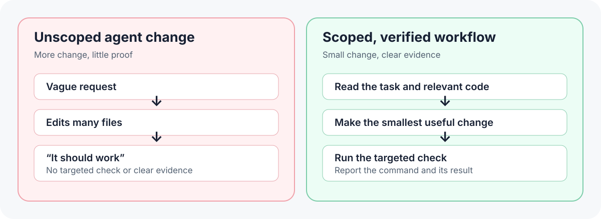

# coding-agent-guidelines

[](LICENSE)
[](CLAUDE.md)
[](.cursor/rules/coding-agent-guidelines.mdc)
[](AGENTS.md)

A short behavioral spec for AI coding agents. One file under 70 lines helps
Claude Code, Codex, Cursor, and other coding agents behave like careful senior
engineers: understand first, change less, verify, and ask before irreversible
actions.

## Install

**Claude Code plugin**

```text
/plugin marketplace add incline-ltd/coding-agent-guidelines
/plugin install coding-agent-guidelines@coding-agent-guidelines
```

**Project file** (appends if the file already exists)

```bash
# Claude Code
curl -fsSL https://raw.githubusercontent.com/incline-ltd/coding-agent-guidelines/main/CLAUDE.md >> CLAUDE.md
# Codex, Cursor, and other agents that read AGENTS.md
curl -fsSL https://raw.githubusercontent.com/incline-ltd/coding-agent-guidelines/main/CLAUDE.md >> AGENTS.md
```

Cursor rules, Codex skills, and other paths are under [Install Options](#install-options).



*Illustrative example, not a measured benchmark. See [worked examples](EXAMPLES.md)
for code-level comparisons.*

## Why It Is Short

An agent reads every line of its instruction file on every request. A
February 2026 study of `AGENTS.md`-style context files
([Gloaguen et al.](https://arxiv.org/abs/2602.11988)) found that they did not
generally improve task success and raised inference cost by over 20% on
average. Agents followed the instructions well; repository overviews did not
help.

So the always-loaded file keeps only rules an agent can act on. Explanations
and tool reference live in [Claude Code notes](docs/CLAUDE_CODE_NOTES.md) and
[worked examples](EXAMPLES.md), outside the agent's context.

## Why This Exists

AI coding agents fail in predictable ways:

- they invent requirements from vague prompts
- they rewrite files instead of making scoped diffs
- they abstract before there is real duplication
- they touch unrelated code while fixing one bug
- they declare success without running checks
- they burn context reading irrelevant files
- they take irreversible actions without asking

This repo turns those lessons into persistent instructions you can install in
real projects.

## What's Included

| Path | Purpose |
| --- | --- |
| [CLAUDE.md](CLAUDE.md) | Project-level behavioral rules for Claude Code |
| [AGENTS.md](AGENTS.md) | Cross-tool agent instructions for agents that read AGENTS.md |
| [SKILL.md](SKILL.md) | Reusable Skill form of the same guidance |
| [.claude/skills/coding-agent-guidelines/SKILL.md](.claude/skills/coding-agent-guidelines/SKILL.md) | Ready-to-copy project skill location |
| [.cursor/rules/coding-agent-guidelines.mdc](.cursor/rules/coding-agent-guidelines.mdc) | Cursor always-on project rule |
| [CURSOR.md](CURSOR.md) | How the Cursor rule works |
| [EXAMPLES.md](EXAMPLES.md) | Before/after failure modes in Python and TypeScript |
| [docs/CLAUDE_CODE_NOTES.md](docs/CLAUDE_CODE_NOTES.md) | Reference notes on context, sub-agents, memory, plan mode, MCP, skills, and models |
| [.claude-plugin/marketplace.json](.claude-plugin/marketplace.json) | Claude Code marketplace catalog |
| [plugins/coding-agent-guidelines](plugins/coding-agent-guidelines) | Installable Claude Code plugin package |
| [.github](.github) | Issue and pull-request templates for public contributions |
| [docs](docs) | Installation, architecture, adoption, and roadmap notes |

## Install Options

### Claude Code: Project Memory

Copy [CLAUDE.md](CLAUDE.md) to the root of any repository:

```bash
cp CLAUDE.md /path/to/your-project/CLAUDE.md
```

Claude Code reads project-level `CLAUDE.md` automatically at session start and
after context compaction.

### Claude Code: Skill

Copy the skill into a project or user skills directory:

```bash
mkdir -p /path/to/your-project/.claude/skills/coding-agent-guidelines
cp SKILL.md /path/to/your-project/.claude/skills/coding-agent-guidelines/SKILL.md
```

### Codex: Skill

Copy the skill into a repository:

```bash
mkdir -p /path/to/your-project/.agents/skills/coding-agent-guidelines
cp SKILL.md /path/to/your-project/.agents/skills/coding-agent-guidelines/SKILL.md
```

Or install it for your user account:

```bash
mkdir -p ~/.agents/skills/coding-agent-guidelines
cp SKILL.md ~/.agents/skills/coding-agent-guidelines/SKILL.md
```

Codex scans these locations and loads the skill when the task matches its
description or when you invoke it directly.

See the [official Codex skill guide](https://learn.chatgpt.com/docs/build-skills)
for all supported skill locations.

### Claude Code: Plugin

Install the plugin from the public GitHub repository:

```text
/plugin marketplace add incline-ltd/coding-agent-guidelines
/plugin install coding-agent-guidelines@coding-agent-guidelines
```

### Cursor

Copy the Cursor rule into your project:

```bash
mkdir -p /path/to/your-project/.cursor/rules
cp .cursor/rules/coding-agent-guidelines.mdc /path/to/your-project/.cursor/rules/
```

The rule uses `alwaysApply: true`, so Cursor includes it for every Agent Chat
request in that project.

### Other Agents

Use [AGENTS.md](AGENTS.md) or [CLAUDE.md](CLAUDE.md) as the source. Paste it into
whatever persistent instruction mechanism your tool supports.

## What The Rules Enforce

1. Understand before editing
2. Smallest sufficient change
3. Edits as diffs, not rewrites
4. Verification before claiming done
5. Efficient work: search first, no retry loops, sub-agents only with a reason,
   plans for risky changes
6. Approval before irreversible actions

A task is done only when the check ran, the diff contains only the requested
change, and assumptions and risks are listed.

## Repository Layout

```text
coding-agent-guidelines/
├── README.md
├── CLAUDE.md
├── AGENTS.md
├── CURSOR.md
├── SKILL.md
├── EXAMPLES.md
├── .cursor/rules/coding-agent-guidelines.mdc
├── .claude/skills/coding-agent-guidelines/SKILL.md
├── .claude-plugin/marketplace.json
├── .github/
├── scripts/validate.mjs
├── plugins/coding-agent-guidelines/
│   ├── .claude-plugin/plugin.json
│   └── skills/coding-agent-guidelines/SKILL.md
└── docs/
```

See [docs/ARCHITECTURE.md](docs/ARCHITECTURE.md) for why the files are duplicated
across root, Cursor, Skill, and plugin install paths.

## Who Should Use This

- developers using Claude Code, Codex, or Cursor daily
- teams that want smaller diffs from AI coding agents
- maintainers tired of agents touching unrelated files
- founders using AI tools to move fast without destroying code quality
- anyone building reusable project rules, skills, or agent playbooks

## Compatibility

Designed for:

- Claude Code project instructions, skills, and plugins
- Codex repository and user skills
- Cursor project rules
- agents that read `AGENTS.md`
- any coding-agent tool with persistent Markdown instructions

## Contributing

See [CONTRIBUTING.md](CONTRIBUTING.md). Good contributions are concrete:
new failure modes, sharper wording, better install paths, or compatibility notes
for another coding tool.

## Security

This repo contains instructions and development validation, not application
runtime code. Still, if you find a supply-chain, plugin packaging, or
malicious-instruction issue, see [SECURITY.md](SECURITY.md).

## Related Public Projects

- [Agent Cost Guard](https://github.com/incline-ltd/agent-cost-guard):
  instructions are text and an agent can ignore them; this local hook stops
  supported cloud-cost commands until a person approves
- [Agent Policy Map](https://github.com/incline-ltd/agent-policy-map):
  shows which instruction files Codex, Claude Code, Cursor, and GitHub Copilot
  load for the same file
- [Awesome Agent Instructions](https://github.com/incline-ltd/awesome-agent-instructions):
  patterns and a skill for reviewing and simplifying coding-agent instructions
  while preserving project constraints
- [Production Launch Prompts](https://github.com/incline-ltd/production-launch-prompts):
  prompts and scorecards for checking whether software is ready to ship
- [Awesome Agentic Engineering](https://github.com/incline-ltd/awesome-agentic-engineering):
  a curated list of practical agent engineering resources

## License

MIT. See [LICENSE](LICENSE).
